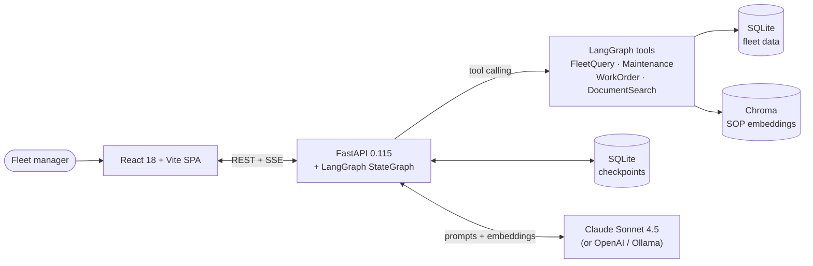

# FleetWise AI — Python + React edition

> A Python/FastAPI + LangGraph + Anthropic Claude rewrite of [FleetWise AI](https://github.com/steven-brett-edwards/fleetwise-ai), with a new React + TypeScript frontend.

**Sister project:** the original .NET + Angular edition lives at [`steven-brett-edwards/fleetwise-ai`](https://github.com/steven-brett-edwards/fleetwise-ai) and is deployed at [fleetwise-frontend.onrender.com](https://fleetwise-frontend.onrender.com). This repo ports the same app to a Python/LangGraph/React stack — same domain, same tool-use surface, same SOP documents, different ecosystem.

## Why two editions?

The original is C# / Angular / Semantic Kernel / OpenAI. This one is Python / React / LangGraph / Anthropic. Shipping the same product twice demonstrates that the interesting work — domain modeling, tool design, RAG, streaming UX, deployment — was deliberate, not accidentally tied to one stack. It also gives the Python edition room to fix three things the .NET version has as rough edges:

1. **Conversation history survives restarts.** LangGraph's `AsyncSqliteSaver` checkpointer replaces the .NET `ConcurrentDictionary<string, ChatHistory>` that evaporates on process restart.
2. **RAG ingestion is idempotent.** Chroma on a persistent volume means the SOP corpus is embedded once, not on every cold start.
3. **SSE framing is newline-safe.** The .NET stream emits `data: {chunk}\n\n` raw, which breaks the client's line-split parser when a chunk contains `\n`. The Python edition escapes newlines on the wire.

## Architecture



## Tech stack

| Layer            | .NET edition                        | Python edition (this repo)                  |
| ---------------- | ----------------------------------- | ------------------------------------------- |
| HTTP             | ASP.NET Core 9                      | FastAPI 0.115 (async)                       |
| Data             | EF Core 9 + SQLite                  | SQLAlchemy 2.x async + aiosqlite            |
| DTOs             | C# records + enum converter         | Pydantic v2 (PascalCase aliases on wire)    |
| AI orchestration | Semantic Kernel 1.74                | LangGraph 0.2 (prebuilt → custom StateGraph)|
| LLM              | OpenAI / Ollama / Groq              | Anthropic Claude / OpenAI / Ollama          |
| Tool calling     | `[KernelFunction]` attributes       | `@tool` + pydantic arg schemas              |
| Vector store     | `InMemoryVectorStore`               | Chroma persistent (volume-backed)           |
| Chat history     | `ConcurrentDictionary` (in-memory)  | LangGraph `AsyncSqliteSaver` (persistent)   |
| Tests            | xUnit + Moq + FluentAssertions      | pytest + pytest-asyncio + httpx             |
| Lint / format    | `dotnet format`                     | `ruff` + `mypy --strict`                    |
| Package manager  | NuGet                               | `uv`                                        |
| Frontend         | Angular 21                          | React 18 + TypeScript + Vite + TanStack Query |
| Deploy           | Render Blueprint (Docker)           | Render Blueprint (Docker) + AWS appendix    |

## Migration plan — summary

The full plan lives in [`docs/migration-plan.md`](./docs/migration-plan.md). Ten phases, ~12–15 days of focused work for the core + 1–1.5 days for the optional ETL.

| Phase | Scope                                                       | Estimate     |
| ----- | ----------------------------------------------------------- | ------------ |
| 0     | Scaffold FastAPI + Dockerfile + hello-world Render deploy   | 30–45 min    |
| 1     | Domain entities, async repositories, seed data              | 1–2 days     |
| 2     | REST API parity with Pydantic DTOs                          | 1 day        |
| 3     | LangGraph prebuilt ReAct agent + 3 tool areas               | 2 days       |
| 4     | Custom `StateGraph` + SSE streaming (with newline-escape)   | 1.5 days     |
| 5     | RAG pipeline (Chroma persistent + heading chunker)          | 1 day        |
| 6     | Provider swap + Render blueprint finalization               | 0.5 day      |
| 7     | pytest + httpx integration suite to parity with .NET        | 1.5–2 days   |
| 8     | README + cross-repo links                                   | 0.5 day      |
| 9     | React + TypeScript + Vite frontend                          | 2–3 days     |
| 10    | *(optional)* ETL for inspection CSVs with LLM header mapping | 1–1.5 days  |

### Design principles (locked in before coding)

1. **API contract is stable.** Python is the source of truth; the React frontend is primary, and the Angular frontend can point here via env-var swap. Internal code uses snake_case; the wire format keeps PascalCase via Pydantic aliases.
2. **Prebuilt first, hand-rolled second.** Phase 3 uses `create_react_agent` to get the tool loop working in an hour. Phase 4 swaps to a custom `StateGraph` with one piece of custom routing (system-prompt conditional on RAG availability).
3. **Async-first.** `async def` routes, SQLAlchemy async session, no sync DB calls inside async handlers.
4. **Two integration-test surfaces that always bite:** SQLAlchemy aggregation queries against real SQLite, and SSE framing. Everything else is a fast unit test with a mocked LLM.
5. **One config source.** Environment variables via Pydantic Settings; `.env.example` documents every knob.
6. **Deploy on day one.** Hello-world deploys to Render at the end of Phase 0 before any domain code exists.

## Highlights

- **Production Python** — FastAPI async, Pydantic v2, SQLAlchemy 2.x async.
- **Clean architecture** — `domain / data / api / ai` separation with typed repositories.
- **React frontend** — Phase 9 ships a React + TypeScript + Vite app consuming the same API.
- **LLM-powered apps: agent orchestration, tool use, RAG** — LangGraph StateGraph, 13 tools across 4 areas, Chroma-backed RAG over fleet SOPs.
- **LLM reliability** — persistent checkpoints, error-resilient streaming, SSE framing fix, conditional tool advertisement.
- **Cloud platforms** — Render primary + AWS appendix (ECS Fargate + RDS + Bedrock option).
- **Data pipelines / unstructured data** — Optional Phase 10 ETL ingests messy inspection CSVs with LLM-driven header mapping.
- **End-to-end ownership** — every phase is a complete deliverable with its own tests, commit, and verification step.

## Status

Active development. Nothing is live yet.

- [x] Phase 0 — Scaffold + Render hello-world
- [x] Phase 1 — Domain + data + seed
- [x] Phase 2 — REST API parity
- [x] Phase 3 — LangGraph prebuilt agent
- [x] Phase 4 — Custom StateGraph + SSE streaming
- [x] Phase 5 — RAG pipeline
- [ ] Phase 6 — Render deploy finalization
- [ ] Phase 7 — Tests + CI
- [ ] Phase 8 — README polish
- [ ] Phase 9 — React frontend
- [ ] Phase 10 — *(optional)* ETL pipeline

## Running locally

> Phase 0 scaffold only — everything below is a hello-world at the moment.

### Prerequisites

- [Python 3.12](https://www.python.org/downloads/)
- [`uv`](https://docs.astral.sh/uv/) (`curl -LsSf https://astral.sh/uv/install.sh | sh`)

### Backend

```bash
uv sync
uv run uvicorn fleetwise.main:app --reload --port 5100
curl http://localhost:5100/api/health
# → {"status":"ok"}
```

### Frontend

Not scaffolded yet — arrives in Phase 9.

## License

Portfolio demonstration; not intended for production use.
