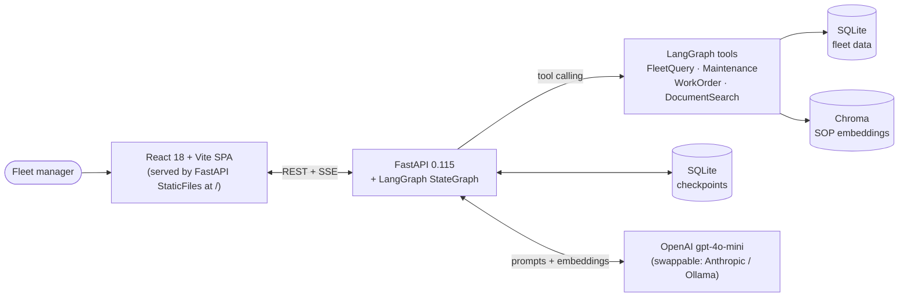

# FleetWise AI — Python + React edition

> A Python/FastAPI + LangGraph rewrite of [FleetWise AI](https://github.com/steven-brett-edwards/fleetwise-ai), with a React + TypeScript frontend served from the same Render service.

**Sister project:** the original .NET + Angular edition lives at [`steven-brett-edwards/fleetwise-ai`](https://github.com/steven-brett-edwards/fleetwise-ai) and is deployed at [fleetwise-frontend.onrender.com](https://fleetwise-frontend.onrender.com). This repo ports the same app to a Python/LangGraph/React stack — same domain, same tool-use surface, same SOP documents, different ecosystem.

## Live demo

**Open [`https://fleetwise-py-api.onrender.com`](https://fleetwise-py-api.onrender.com)** — the React app loads, the chat connects to the deployed LangGraph agent, and the dashboard pulls live fleet data. Render free tier cold-starts after idle, so the first request can take ~30 seconds; subsequent requests are fast.

### What to try in the chat view

A 90-second tour that exercises every layer:

1. **"What vehicles does Public Works have?"** — renders a table via the `search_vehicles` SQL tool-call.
2. **"What's the anti-idling rule?"** — answered from an ingested SOP via the `search_fleet_documentation` RAG tool.
3. **(follow-up in the same thread) "Which of those are overdue for maintenance?"** — demonstrates checkpointed conversation state and multi-tool reasoning across `search_vehicles` + `get_overdue_maintenance`.

### Prefer the API directly?

```bash
API=https://fleetwise-py-api.onrender.com
curl -sS "$API/api/health"
# → {"status":"ok"}
```

**Sync chat — tool dispatch over live fleet data.**

```bash
curl -sS -X POST "$API/api/chat" -H 'Content-Type: application/json' \
  -d '{"Message": "Which vehicles are in the Public Works department?"}'
```

```json
{
  "Response": "Here is the list of vehicles in the Public Works department: ...12 vehicles formatted as a table...",
  "ConversationId": "c4be51ce-3681-4b9f-94ef-a00538329958",
  "FunctionsUsed": ["search_vehicles"]
}
```

**Streaming chat — SSE with named events.** `tool` frames announce tool dispatch, `token` frames stream model output (newlines escaped on the wire — the .NET SSE bug fix), `done` frame terminates.

```text
event: tool
data: get_fleet_summary

event: token
data: Here's

event: token
data:  a

event: token
data:  summary ...

event: done
data: [DONE]
```

**RAG — grounded in the ingested SOP corpus.**

```bash
curl -sS -X POST "$API/api/chat" -H 'Content-Type: application/json' \
  -d '{"Message": "What is the anti-idling policy?"}'
```

```json
{
  "Response": "The anti-idling policy states that fleet vehicles must not idle for more than 3 consecutive minutes unless specific conditions apply...",
  "ConversationId": "a57879ba-...",
  "FunctionsUsed": ["search_fleet_documentation"]
}
```

## Why two editions?

The original is C# / Angular / Semantic Kernel. This one is Python / React / LangGraph. Both run on OpenAI for chat and embeddings — keeping the LLM constant means the diff between them is the parts that actually matter: domain modeling, agent orchestration, RAG, streaming UX, deployment. The Python edition is also a chance to fix three rough edges from the .NET version:

1. **Conversation history survives restarts.** LangGraph's `AsyncSqliteSaver` checkpointer replaces the .NET `ConcurrentDictionary<string, ChatHistory>` that evaporates on process restart.
2. **RAG ingestion is idempotent.** Chroma on a persistent volume means the SOP corpus is embedded once, not on every cold start.
3. **SSE framing is newline-safe.** The .NET stream emits `data: {chunk}\n\n` raw, which breaks the client's line-split parser when a chunk contains `\n`. The Python edition escapes newlines on the wire.

## Architecture



## Tech stack

| Layer            | .NET edition                        | Python edition (this repo)                  |
| ---------------- | ----------------------------------- | ------------------------------------------- |
| HTTP             | ASP.NET Core 9                      | FastAPI 0.115 (async)                       |
| Data             | EF Core 9 + SQLite                  | SQLAlchemy 2.x async + aiosqlite            |
| DTOs             | C# records + enum converter         | Pydantic v2 (PascalCase aliases on wire)    |
| AI orchestration | Semantic Kernel 1.74                | LangGraph 0.2 (prebuilt → custom StateGraph)|
| LLM              | OpenAI / Ollama / Groq              | OpenAI / Anthropic / Ollama (provider-swap) |
| Tool calling     | `[KernelFunction]` attributes       | `@tool` + pydantic arg schemas              |
| Vector store     | `InMemoryVectorStore`               | Chroma persistent (volume-backed)           |
| Chat history     | `ConcurrentDictionary` (in-memory)  | LangGraph `AsyncSqliteSaver` (persistent)   |
| Tests            | xUnit + Moq + FluentAssertions      | pytest + pytest-asyncio + httpx             |
| Lint / format    | `dotnet format`                     | `ruff` + `mypy --strict`                    |
| Package manager  | NuGet                               | `uv`                                        |
| Frontend         | Angular 21                          | React 18 + TypeScript + Vite + TanStack Query |
| Deploy           | Render Blueprint (Docker)           | Render Blueprint (Docker) + AWS appendix    |

## Migration plan — summary

The full plan lives in [`docs/migration-plan.md`](./docs/migration-plan.md). Ten phases, ~12–15 days of focused work for the core + 1–1.5 days for the optional ETL.

| Phase | Scope                                                       | Estimate     |
| ----- | ----------------------------------------------------------- | ------------ |
| 0     | Scaffold FastAPI + Dockerfile + hello-world Render deploy   | 30–45 min    |
| 1     | Domain entities, async repositories, seed data              | 1–2 days     |
| 2     | REST API parity with Pydantic DTOs                          | 1 day        |
| 3     | LangGraph prebuilt ReAct agent + 3 tool areas               | 2 days       |
| 4     | Custom `StateGraph` + SSE streaming (with newline-escape)   | 1.5 days     |
| 5     | RAG pipeline (Chroma persistent + heading chunker)          | 1 day        |
| 6     | Provider swap + Render blueprint finalization               | 0.5 day      |
| 7     | pytest + httpx integration suite to parity with .NET        | 1.5–2 days   |
| 8     | README + cross-repo links                                   | 0.5 day      |
| 9     | React + TypeScript + Vite frontend                          | 2–3 days     |
| 10    | *(optional)* ETL for inspection CSVs with LLM header mapping | 1–1.5 days  |

### Design principles (locked in before coding)

1. **API contract is stable.** Python is the source of truth; the React frontend is primary, and the Angular frontend can point here via env-var swap. Internal code uses snake_case; the wire format keeps PascalCase via Pydantic aliases.
2. **Prebuilt first, hand-rolled second.** Phase 3 uses `create_react_agent` to get the tool loop working in an hour. Phase 4 swaps to a custom `StateGraph` with one piece of custom routing (system-prompt conditional on RAG availability).
3. **Async-first.** `async def` routes, SQLAlchemy async session, no sync DB calls inside async handlers.
4. **Two integration-test surfaces that always bite:** SQLAlchemy aggregation queries against real SQLite, and SSE framing. Everything else is a fast unit test with a mocked LLM.
5. **One config source.** Environment variables via Pydantic Settings; `.env.example` documents every knob.
6. **Deploy on day one.** Hello-world deploys to Render at the end of Phase 0 before any domain code exists.

## Highlights

- **Production Python** — FastAPI async, Pydantic v2, SQLAlchemy 2.x async.
- **Clean architecture** — `domain / data / api / ai` separation with typed repositories.
- **React frontend** — React 18 + TypeScript + Vite + TanStack Query, served by FastAPI in prod (one Render service, no prod CORS).
- **LLM-powered apps: agent orchestration, tool use, RAG** — LangGraph StateGraph, 13 tools across 4 areas, Chroma-backed RAG over fleet SOPs.
- **LLM reliability** — persistent checkpoints, error-resilient streaming, SSE framing fix, conditional tool advertisement.
- **Cloud platforms** — Render primary + AWS appendix (ECS Fargate + RDS + Bedrock option).
- **Data pipelines / unstructured data** — Optional Phase 10 ETL ingests messy inspection CSVs with LLM-driven header mapping.
- **End-to-end ownership** — every phase is a complete deliverable with its own tests, commit, and verification step.

## Built with Claude Code

Every line of this project was shipped using [Claude Code](https://claude.com/claude-code) as the primary coding partner. The workflow shows up across the commit history:

- **Plan → Edit → Review loops.** Each phase started in plan mode — Claude explored the codebase, drafted a phase plan against `docs/migration-plan.md`, and only exited plan mode after the approach was concrete enough to execute. The plan files (e.g. the Phase 3 LangGraph plan, the Phase 9 v1 same-day-ship plan) are preserved in the migration guide as a record of how each chunk was scoped before code touched disk.
- **Subagent workflows.** Exploration, code review, and "second opinion" passes were delegated to specialized subagents so the main thread stayed focused on the change at hand. The Phase 5 RAG wiring bug (a `from`-import vs `monkeypatch` mismatch in the agent module) was caught by a review subagent before the PR opened.
- **`TodoWrite` for multi-phase planning.** Each phase carried a live todo list scoped to that PR — visible in the transcripts, surfaced in the Claude Code UI — so progress was always one query away from the work itself. Phases that drifted (Phase 6 disk-mount-on-free-tier, Phase 9 v1 vs v2 scope split) re-grounded against the todo list rather than against memory.

The migration guide in [`docs/migration-plan.md`](./docs/migration-plan.md) was itself a Claude Code artifact: drafted in plan mode at the start of the project, refined session-by-session as decisions firmed up, and used as the source of truth every time a new phase started. Claude Code is in daily use here since January 2026.

## Status

Live at [fleetwise-py-api.onrender.com](https://fleetwise-py-api.onrender.com) — backend + React frontend on one Render service.

- [x] Phase 0 — Scaffold + Render hello-world
- [x] Phase 1 — Domain + data + seed
- [x] Phase 2 — REST API parity
- [x] Phase 3 — LangGraph prebuilt agent
- [x] Phase 4 — Custom StateGraph + SSE streaming
- [x] Phase 5 — RAG pipeline
- [x] Phase 6 — Render deploy finalization
- [ ] Phase 7 — Tests + CI polish (coverage floor + SQLite aggregation regression test)
- [x] Phase 8 — README polish
- [x] Phase 9 v1 — React frontend (Dashboard / Vehicles / Chat)
- [ ] Phase 9 v2 — Frontend depth (Vehicle detail + Work orders, MSW component tests)
- [ ] Phase 10 — *(optional)* ETL pipeline

## Running locally

### Prerequisites

- [Python 3.12](https://www.python.org/downloads/)
- [`uv`](https://docs.astral.sh/uv/) (`curl -LsSf https://astral.sh/uv/install.sh | sh`)
- An API key for at least one LLM provider. The deployed demo runs on OpenAI for both chat (`gpt-4o-mini`) and embeddings (`text-embedding-3-small`); the provider factory also supports Anthropic for chat and Ollama for both, configured via `AI_PROVIDER` in `.env`. Anthropic has no embeddings endpoint, so when chat is Anthropic the embedding side falls back to OpenAI or Ollama.

### Backend

```bash
uv sync
cp .env.example .env   # default: AI_PROVIDER=openai + OPENAI_API_KEY (matches the deployed demo)
uv run uvicorn fleetwise.main:app --reload --port 5100

curl -sS http://localhost:5100/api/vehicles/summary                 # REST
curl -sS -X POST http://localhost:5100/api/chat \
  -H 'Content-Type: application/json' \
  -d '{"Message": "Summarize the fleet."}'                          # chat
```

Tests:

```bash
uv run ruff check . && uv run ruff format --check .
uv run mypy src/
uv run pytest --cov=fleetwise --cov-report=term-missing
```

### Frontend

```bash
cd frontend
npm install
npm run dev      # Vite on http://localhost:5173, /api/* proxied to localhost:8000
```

The dev server proxies `/api/*` to `http://localhost:8000` (configured in `vite.config.ts`), so you point the backend at port 8000 and the frontend at 5173 and they talk to each other without CORS. To target a different backend (the deployed Render service, for example), set `VITE_API_BASE_URL` in `frontend/.env.development`.

```bash
npm run build    # production bundle into frontend/dist/
npm run test     # vitest
```

In production, `frontend/dist/` is copied into the Docker image and served by FastAPI's `StaticFiles` mount at `/`, so the API and UI ship from one Render service.

## License

Portfolio demonstration; not intended for production use.
